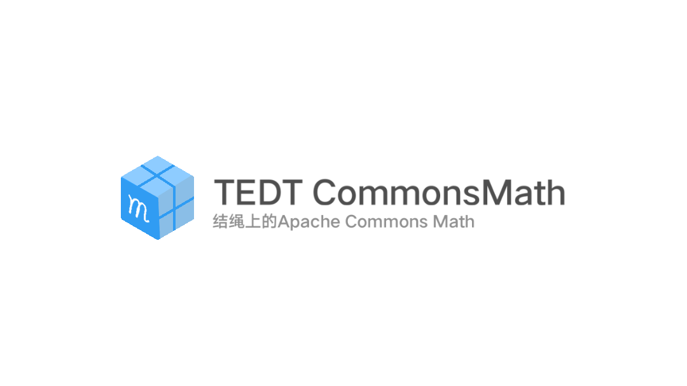

# 公用数学包 (Apache Commons Math For Tiecode)



基于 Apache Commons Math 3.6.1 为结绳中文编程封装的数学工具库，提供统计、分布、矩阵、随机数、分数及基础数学函数支持。

---

# 🚀 使用步骤（必看）

如果只是想直接用绳包本体：

1. 打开结绳（推荐4.6版本，在4.1版本的可用性未测试），进入你需要用的项目。
2. 点击右上角三点，**选择“安装绳包”**。
3. 在**build/outputs/packageLib/Debug**里选择“公用数学包.tlb”文件。
4. 回到文件树部分。长按“绳包”项；选择“管理绳包”，勾选新导入的包后点击确定。

如果显示“导入成功”，恭喜你🎉 你已经可以按下面的使用示例调用了！

如果你想修改源代码，更简单（以MT管理器为例）：

1. 下载好源码的zip文件，打开；把整个“CommonsMath包”目录移到**内部存储/Tiecode/Projects**里。
2. 回到结绳App。如果多了一个项目，再次恭喜你！🎉你可以随便改了！

---

# 📚 模块列表

类文件 功能描述: 

数据统计: 
- 静态统计.t 基础一次性统计
- 动态统计.t 描述性统计（平均值、标准差、百分位数等），支持滑动窗口
- 汇总统计.t 轻量级汇总统计（适合流式数据）

分布统计: 
- 正态分布.t 正态（高斯）分布的概率密度、累积概率、逆累积及随机采样
- 均匀分布.t 连续均匀分布（支持上下界）
- 实数矩阵.t 矩阵创建、加减乘、转置、逆矩阵、行列式等（包装类）

随机生成: 
- 随机数生成器.t 各类随机数生成（整数、小数、高斯、文本等）

运端工具: 
- 分数.t 分数运算（加减乘除、约分、转小数）
- 数学工具.t 阶乘、组合/排列数、最大公约数、安全运算、四舍五入等

---

# 🧪 使用示例

1. 一次性计算统计

```tie
//该类标注了 @全局类，因此所有静态方法可直接调用，无需加类名前缀（除非存在同名方法冲突）。

//基础统计（总和、均值、方差、最值等）

变量 数据 : 小数[] = {1.2, 2.3, 3.4, 4.5, 5.6}
调试输出("总和：" + 求和(数据))
调试输出("均值：" + 求均值(数据))
调试输出("方差：" + 求方差(数据))
调试输出("标准差：" + 求标准差(数据))
调试输出("最小值：" + 取最小值(数据))
调试输出("最大值：" + 取最大值(数据))
调试输出("中位数：" + 求中位数(数据))
调试输出("几何平均数：" + 求几何平均数(数据))

//百分位数与众数

变量 分数 : 小数[] = {80, 85, 90, 85, 92, 88, 85}
调试输出("第75百分位数：" + 求百分位(分数, 75))
变量 众数数组 : 小数[] = 查找众数(分数)   // 返回一个数组，可能有多个众数
调试输出("众数：" + 数组到文本(众数数组))

//数据归一化（Min-Max 缩放）

变量 原始 : 小数[] = {10, 20, 30, 40, 50}
变量 归一化后 : 小数[] = 归一化(原始)   // 结果在 0~1 之间
调试输出("归一化结果：" + 数组到文本(归一化后))

//4. 协方差与皮尔逊相关系数（两组等长数据）

变量 x : 小数[] = {1, 2, 3, 4, 5}
变量 y : 小数[] = {2, 4, 6, 8, 10}
变量 协方差值 = 求协方差(x, y)        // 2.5
变量 相关系数 = 求相关系数(x, y)      // 1.0（完全线性正相关）
调试输出("协方差：" + 协方差值)
调试输出("相关系数：" + 相关系数)

//获取汇总统计（JSON 格式输出）

变量 样本 : 小数[] = {1.5, 2.7, 3.1, 4.2, 5.9}
变量 摘要 : 文本 = 获取汇总统计(样本)
调试输出(摘要)
// 输出示例（JSON 字符串）：
// {"count":"5","min":"1.5","max":"5.9","mean":"3.48","median":"3.1","std":"1.69516","variance":"2.8735"}


```

2. 描述性统计

```tie
变量 统计 : 描述统计 = 描述统计.新建(50)   // 窗口大小50
统计.添加值(10.5)
统计.添加值(20.3)
统计.添加值(15.7)
调试输出("平均值：" + 统计.取平均值())
调试输出("标准差：" + 统计.取标准差())
调试输出("第90百分位数：" + 统计.取百分位数(90))
```

3. 正态分布计算

```tie
变量 正态 : 正态分布 = (0, 1)   // 均值0，标准差1
变量 p = 正态.累积概率(1.96)    // 0.975...
变量 x = 正态.逆累积概率(0.975) // 1.96...
调试输出(p, x)
```

4. 矩阵运算

```tie
变量 A : 实数矩阵 = { {1, 2}, {3, 4} }
变量 B : 实数矩阵 = A.乘(A)
调试输出(B.到文本())   // 显示矩阵乘积
变量 det = A.取行列式() // -2
变量 inv = A.取逆矩阵()
```

5. 随机数生成

```tie
变量 随机 : 随机数生成器 = 随机数生成器.创建带种子(12345)
变量 整数 = 随机.随机整数(1, 100)
变量 小数 = 随机.随机小数(0.0, 1.0)
变量 验证码 = 随机.随机文本(6, "ABCDEFGHIJKLMNOPQRSTUVWXYZ")
调试输出(整数, 小数, 验证码)
```

6. 分数运算

```tie
变量 f1 : 分数 = (1, 3)
变量 f2 : 分数 = (2, 5)
变量 f3 = f1.加(f2)   // 11/15
调试输出(f3.到文本(), f3.取小数())
```

7. 数学工具函数

```tie
调试输出(数学工具.取阶乘(10))           // 3628800
调试输出(数学工具.取组合数(8, 3))       // 56
调试输出(数学工具.取最大公约数(48, 18)) // 6
调试输出(数学工具.四舍五入(3.14159, 2)) // 3.14
```

---

# ⚠️ 注意事项

- 矩阵、分数等为包装类，内部持有真实对象，操作方法均通过结绳语法封装。
- 若需更多分布（如 T 分布、卡方分布）或优化算法，可参考 Commons Math 官方文档自行扩展封装。
- 使用前请确认 JAR 路径正确，否则编译时会报类缺失错误。
- 数学工具类中的 安全相加 / 安全相乘 在溢出时会抛出异常，适合需要严格校验的场景。

---

# 📖 参考资料

- Apache Commons Math 官方文档
- Commons Math Javadoc

---

# 🤝 贡献与反馈

欢迎在结绳QQ群（938828067）中讨论使用问题，或提交改进建议。本库旨在为结绳开发者提供便捷的数学计算能力，后续版本可能会扩展更多功能。

***Happy Coding with Tiecode！***
